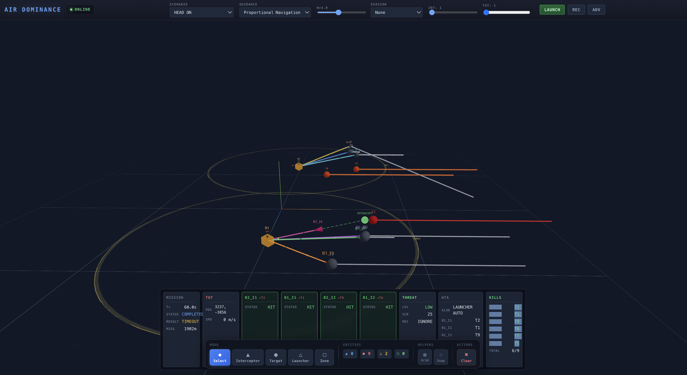

# Air Dominance

**A next-generation tactical air combat simulation platform for training, analysis, and autonomous systems development.**

[](https://www.python.org/downloads/)
[](https://www.typescriptlang.org/)
[](https://opensource.org/licenses/MIT)

---

## Overview

Air Dominance is a high-fidelity, real-time simulation environment for air-to-air engagement scenarios. Built for defense analysts, autonomy researchers, and aerospace engineers, it provides a comprehensive sandbox for:

- **Guidance Law Development** — Test and compare pursuit, proportional navigation, and augmented PN algorithms
- **Weapon System Analysis** — Evaluate engagement envelopes, kill probabilities, and multi-target scenarios
- **Autonomous Systems Research** — Develop swarm tactics, AI/ML threat assessment, and human-machine teaming
- **Training & Education** — Interactive 3D visualization with real-time telemetry for concept demonstration



---

## Key Capabilities

### Real-Time 3D Tactical Display

Immersive command center visualization powered by Three.js:
- Live entity tracking with velocity vectors and trail histories
- Intercept geometry overlays (LOS, aspect angle, predicted intercept points)
- Sensor coverage rings and detection zones
- Engagement zone (killbox) visualization
- Military-standard symbology and color coding

### Multi-Target Engagement

Simultaneous prosecution of multiple threats:
- 1-20+ targets per scenario with independent tracking
- Weapon-Target Assignment (WTA) algorithms: Greedy, Threat-Priority, Hungarian Optimal
- Real-time reassignment as the tactical picture evolves
- Per-target threat scoring and prioritization

### Launch Platform Simulation

Autonomous missile launch systems (bogeys):
- Configurable detection range and magazine capacity
- Auto-launch with lead prediction
- Target acquisition and track management
- Command center alerts: "FOX THREE", "WINCHESTER", "SPLASH"

### Advanced Guidance Laws

Industry-standard missile guidance implementations:
- **Pure Pursuit** — Direct intercept geometry
- **Proportional Navigation (PN)** — LOS rate nulling with tunable N constant
- **Augmented PN** — Target acceleration compensation
- **ML-Based Guidance** — Neural network policy inference via ONNX

### Target Evasion Modeling

Realistic threat maneuvers to stress-test guidance:
- Constant-G turns
- Weave (S-turn) patterns
- Barrel roll (3D spiral)
- Random jinking with configurable intensity

### Sensor & Track Fusion

Full sensor-to-shooter chain modeling:
- Range/angle measurement noise
- Detection probability curves
- 6-state Kalman filtering per track
- Multi-sensor fusion with covariance intersection
- Track quality and confidence scoring

### Environmental Effects

Atmospheric realism for high-fidelity analysis:
- Wind fields with gust modeling
- Altitude-dependent air density
- Aerodynamic drag (configurable per entity)
- Terrain masking and radar horizon

### Swarm Coordination

Multi-agent autonomous behavior:
- Formation control: V, echelon, wedge, line abreast, trail, diamond
- Reynolds flocking: separation, alignment, cohesion
- Dynamic leader following with slot assignment
- Collision avoidance

### Human-Machine Teaming

Adjustable autonomy for operator-in-the-loop studies:
- Authority levels: Full Auto, Human-on-Loop, Human-in-Loop, Manual
- Action proposal and approval workflows
- Workload metrics (decisions/minute, fatigue modeling)
- Trust calibration (AI accuracy, override rates)

### Monte Carlo Analysis

Statistical validation for system performance:
- Batch simulation with configurable noise injection
- Intercept rate, miss distance distributions
- Parameter sweeps across guidance constants
- Engagement envelope mapping with heatmap visualization

### Recording & Replay

Mission debrief and analysis tools:
- 50Hz state capture to disk
- Frame-accurate playback with pause/seek
- Speed control for slow-motion analysis

---

## Quick Start

### Prerequisites

- Python 3.11+
- Node.js 18+
- Modern browser with WebGL support

### Installation

```bash
# Clone the repository
git clone https://github.com/yourorg/air-dominance.git
cd air-dominance

# Backend setup
cd backend
uv sync  # or: pip install -e .
python server.py

# Frontend setup (new terminal)
cd frontend
npm install
npm run dev
```

### Access the Application

- **Frontend UI**: http://localhost:5173
- **Backend API**: http://localhost:8000
- **API Docs**: http://localhost:8000/docs

---

## Architecture

```
┌─────────────────────────────────────────────────────────────────────────┐
│                           FRONTEND (React + Three.js)                   │
│  ┌──────────────┐ ┌──────────────┐ ┌──────────────┐ ┌──────────────┐   │
│  │ 3D Tactical  │ │   Control    │ │   Command    │ │   Mission    │   │
│  │   Display    │ │    Panel     │ │Center Alerts │ │   Planner    │   │
│  └──────────────┘ └──────────────┘ └──────────────┘ └──────────────┘   │
│                              │ WebSocket (50Hz)                         │
└──────────────────────────────┼──────────────────────────────────────────┘
                               │
┌──────────────────────────────┼──────────────────────────────────────────┐
│                           BACKEND (FastAPI + Python)                    │
│  ┌──────────────┐ ┌──────────────┐ ┌──────────────┐ ┌──────────────┐   │
│  │  Simulation  │ │   Guidance   │ │    Sensor    │ │   Threat     │   │
│  │    Engine    │ │     Laws     │ │   Modeling   │ │  Assessment  │   │
│  └──────────────┘ └──────────────┘ └──────────────┘ └──────────────┘   │
│  ┌──────────────┐ ┌──────────────┐ ┌──────────────┐ ┌──────────────┐   │
│  │    Swarm     │ │   Terrain    │ │   Datalink   │ │  Human-ML    │   │
│  │   Tactics    │ │   Masking    │ │   Modeling   │ │   Teaming    │   │
│  └──────────────┘ └──────────────┘ └──────────────┘ └──────────────┘   │
│  ┌──────────────┐ ┌──────────────┐ ┌──────────────┐ ┌──────────────┐   │
│  │   Launch     │ │    Track     │ │  Cooperative │ │   AI/ML      │   │
│  │  Platforms   │ │    Fusion    │ │  Engagement  │ │  Inference   │   │
│  └──────────────┘ └──────────────┘ └──────────────┘ └──────────────┘   │
└─────────────────────────────────────────────────────────────────────────┘
```

---

## Use Cases

### Defense & Aerospace

- Weapon system performance analysis
- Engagement envelope characterization
- Countermeasure effectiveness studies
- Multi-platform coordination concepts

### Autonomy Research

- Reinforcement learning for guidance policies
- Swarm behavior algorithm development
- Human-autonomy teaming experiments
- Sensor fusion algorithm validation

### Training & Education

- Missile guidance concept demonstration
- Intercept geometry visualization
- Tactical decision-making training
- Systems engineering coursework

---

## API Reference

Full REST API with real-time WebSocket streaming:

| Category | Endpoint | Description |
|----------|----------|-------------|
| **Simulation** | `POST /runs` | Start engagement scenario |
| | `POST /runs/stop` | Terminate current run |
| | `GET /scenarios` | List available scenarios |
| **Guidance** | `GET /guidance` | Available guidance laws |
| | `GET /intercept-geometry` | Real-time intercept parameters |
| **Weapons** | `GET /wta/algorithms` | WTA algorithm options |
| | `GET /wta/assignments` | Current target assignments |
| **Sensors** | `GET /sensor/tracks` | Kalman-filtered tracks |
| | `GET /sensor/fused-tracks` | Multi-sensor fusion output |
| **Platforms** | `GET /launchers` | Active launch platforms |
| **Analysis** | `POST /monte-carlo` | Batch statistical analysis |
| | `POST /envelope` | Engagement envelope sweep |
| **Autonomy** | `GET /swarm/status` | Formation and swarm state |
| | `GET /hmt/pending` | Actions awaiting approval |
| **Recording** | `GET /recordings` | Saved mission files |
| | `POST /replay/{id}/start` | Begin playback |

**WebSocket**: `ws://localhost:8000/ws` — 50Hz state stream with entities, tracks, assignments, and launcher events.

---

## Configuration

### Scenario Parameters

```python
{
  "scenario": "head_on",           # Preset geometry
  "guidance": "proportional_nav",  # Guidance law
  "nav_constant": 4.0,             # PN gain (3-5 typical)
  "evasion": "weave",              # Target maneuver type
  "num_targets": 3,                # Simultaneous threats
  "num_interceptors": 4,           # Available weapons
  "wta_algorithm": "hungarian"     # Assignment optimization
}
```

### Environment Settings

```python
{
  "wind_speed": 15.0,        # m/s
  "wind_direction": 270,     # degrees (West)
  "wind_gusts": 5.0,         # gust amplitude
  "enable_drag": true        # aerodynamic effects
}
```

### Human-Machine Teaming

```python
{
  "authority_level": "human_in_loop",  # Approval required
  "approval_timeout": 5.0,             # seconds
  "auto_approve_on_timeout": false,    # fail-safe behavior
  "confidence_threshold": 0.8          # auto-approve above this
}
```

---

## Technical Specifications

| Parameter | Value |
|-----------|-------|
| Simulation Rate | 50 Hz (20ms timestep) |
| Coordinate System | ENU (East-North-Up) |
| Units | SI (meters, m/s, m/s²) |
| WebSocket Latency | <5ms typical |
| Max Entities | 100+ simultaneous |
| Track Capacity | Unlimited with Kalman state |

---

## Project Structure

```
air-dominance/
├── backend/
│   ├── sim/
│   │   ├── engine.py        # Core simulation loop
│   │   ├── guidance.py      # PP, PN, APN, ML guidance
│   │   ├── evasion.py       # Target maneuver models
│   │   ├── sensor.py        # Detection & Kalman tracking
│   │   ├── fusion.py        # Multi-sensor track fusion
│   │   ├── assignment.py    # Weapon-target assignment
│   │   ├── threat.py        # Threat scoring & prioritization
│   │   ├── launcher.py      # Launch platform modeling
│   │   ├── swarm.py         # Formation & flocking
│   │   ├── terrain.py       # DEM & LOS masking
│   │   ├── datalink.py      # Communication modeling
│   │   ├── hmt.py           # Human-machine teaming
│   │   ├── cooperation.py   # Multi-platform coordination
│   │   ├── environment.py   # Wind, drag, atmosphere
│   │   ├── envelope.py      # Engagement envelope analysis
│   │   ├── monte_carlo.py   # Batch simulation
│   │   ├── recording.py     # State capture & replay
│   │   └── ml/              # ONNX inference module
│   └── server.py            # FastAPI application
├── frontend/
│   └── src/
│       ├── components/
│       │   ├── Scene.tsx           # Three.js 3D display
│       │   ├── ControlPanel.tsx    # Mission controls
│       │   ├── MissionPlanner.tsx  # Entity placement
│       │   ├── HMTToast.tsx        # Approval notifications
│       │   └── LaunchEventToast.tsx # Combat alerts
│       ├── hooks/
│       │   └── useSimulation.ts    # WebSocket & state
│       └── types.ts                # TypeScript interfaces
└── README.md
```

---

## Roadmap

### Near-Term
- Electronic warfare (jamming, ECCM, IR countermeasures)
- Stealth modeling (RCS reduction, aspect-dependent signatures)
- Fuel and endurance constraints

### Mid-Term
- Multi-domain operations (surface-to-air, maritime)
- Waypoint-based mission planning with dynamic replanning
- Federated learning for distributed autonomy

### Long-Term
- Digital twin integration with hardware-in-the-loop
- Distributed simulation (HLA/DIS compliant)
- VR/AR operator interfaces

---

## Contributing

We welcome contributions from the defense, aerospace, and autonomy communities. Please see [CONTRIBUTING.md](CONTRIBUTING.md) for guidelines.

---

## License

MIT License. See [LICENSE](LICENSE) for details.

---

## Acknowledgments

Built with:
- [FastAPI](https://fastapi.tiangolo.com/) — High-performance Python web framework
- [Three.js](https://threejs.org/) — 3D graphics library
- [React](https://reactjs.org/) — UI framework
- [ONNX Runtime](https://onnxruntime.ai/) — ML inference engine

---

<p align="center">
  <strong>Air Dominance</strong> — Tactical Simulation for the Next Generation
</p>
