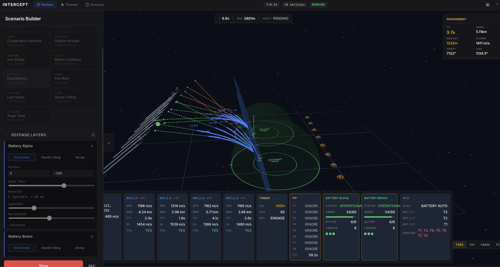
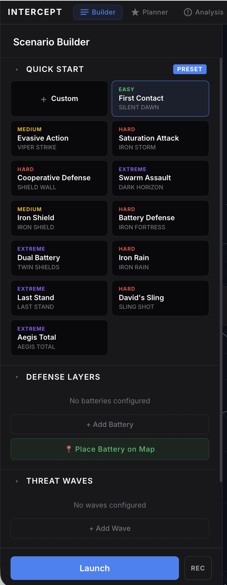

# Intercept

A real-time air defense simulation I built to understand how missile guidance, threat evaluation, and multi-layer defense systems actually work — not from textbooks, but by implementing the math and watching it play out in 3D.

<p align="center">
  
  <br>
  
</p>

## Why I Built This

I wanted to understand the engineering behind systems like Iron Dome. Not the politics — the math. How does proportional navigation actually guide a missile? What happens when you throw 20 threats at a defense system simultaneously? How do you assign interceptors to targets optimally when you have limited ammunition?

Reading papers and textbooks gave me formulas. Building this gave me intuition.

## What You Can Learn

- **Guidance laws** — Proportional navigation drives the line-of-sight rate to zero. Pure pursuit curves behind a turning target and fails. Augmented PN accounts for target acceleration. Tweak the navigation constant (N=3 vs N=5) and see why it matters.
- **The assignment problem** — With 1 interceptor and 1 target, guidance is the whole challenge. With 4 interceptors and 6 targets, *who shoots what* matters as much as *how*. Hungarian algorithm gives optimal assignment. Greedy is faster but worse. You can see the tradeoff.
- **Defense in depth** — Short-range (Iron Dome), medium-range (David's Sling), and long-range (Arrow) tiers each have different engagement envelopes. TEWA (Threat Evaluation and Weapon Assignment) decides which layer handles which threat.
- **What breaks under pressure** — Crank up the threat count. Add evasive maneuvers. Introduce sensor noise. Watch intercept rates drop and understand exactly why.

## Quick Start

```bash
docker compose up --build
```

Open **http://localhost:8000**.

## How to Use

1. **Pick a scenario** — The Scenario Builder (left panel) has presets ranging from a single head-on intercept to full saturation attacks. Start with "First Contact" to see the basics.

2. **Or build your own** — Add defense batteries (pick tier, position, ammo count), configure threat waves (type, count, timing, direction), and place protected areas on the map.

3. **Hit Launch** — The simulation runs at 50Hz. You'll see interceptors launch, guidance corrections in real-time, and intercept/miss outcomes with explosion effects.

4. **Explore while it runs** — Switch camera modes (keys 1-4), open the Analysis panel for Monte Carlo batch runs or engagement envelope heatmaps, and check the telemetry HUD at the bottom for live intercept geometry.

## How It Works

The backend runs a fixed-timestep physics simulation at 50Hz. Each tick: targets move (with optional evasion maneuvers), guidance laws compute interceptor acceleration commands, environment effects (wind, drag) are applied, and interception is checked using closest-point-of-approach with a probabilistic kill model.

State streams to the frontend over WebSocket. The React/Three.js frontend renders entities, trails, and effects in real-time. No polling — everything is push-based.

## Stack

| | |
|---|---|
| Frontend | React, Three.js (React Three Fiber), TypeScript, Vite |
| Backend | Python, FastAPI, WebSocket, NumPy/SciPy |
| Deploy | Docker — single container, port 8000 |

## Project Structure

```
backend/
  server.py              # FastAPI + WebSocket + static serving
  sim/
    engine.py            # Core simulation loop (50Hz fixed timestep)
    entities.py          # Missile and target physics
    guidance.py          # PN, APN, pure pursuit
    evasion.py           # Barrel roll, S-turn, jinking, weave
    intercept.py         # Intercept geometry (LOS rate, closing velocity, CPA)
    threat.py            # Threat scoring and prioritization
    assignment.py        # Weapon-target assignment (Hungarian, greedy, auction)
    battery.py           # Defense battery system
    tewa.py              # Threat Evaluation & Weapon Assignment controller
    waves.py             # Threat wave spawning and scheduling
    ipp.py               # Impact point prediction and Pk model
    environment.py       # Wind fields, drag
    monte_carlo.py       # Batch statistical analysis
frontend/
  src/
    App.tsx              # Main layout and state management
    components/
      Scene.tsx          # Three.js 3D visualization
      ScenarioBuilder.tsx # Scenario configuration UI
    hooks/
      useSimulation.ts   # WebSocket connection and API integration
    types.ts             # Shared TypeScript interfaces
```

## Keyboard Shortcuts

| Key | Action |
|-----|--------|
| Space | Launch / Stop |
| Esc | Abort |
| R | Toggle recording |
| 1-4 | Camera modes (Free / Chase / Tactical / Cinematic) |
| A | Analysis panel |

## References

- Zarchan, *Tactical and Strategic Missile Guidance* — the bible for proportional navigation
- Siouris, *Missile Guidance and Control Systems*
- Kuhn, *The Hungarian Method for the Assignment Problem*

## License

MIT
